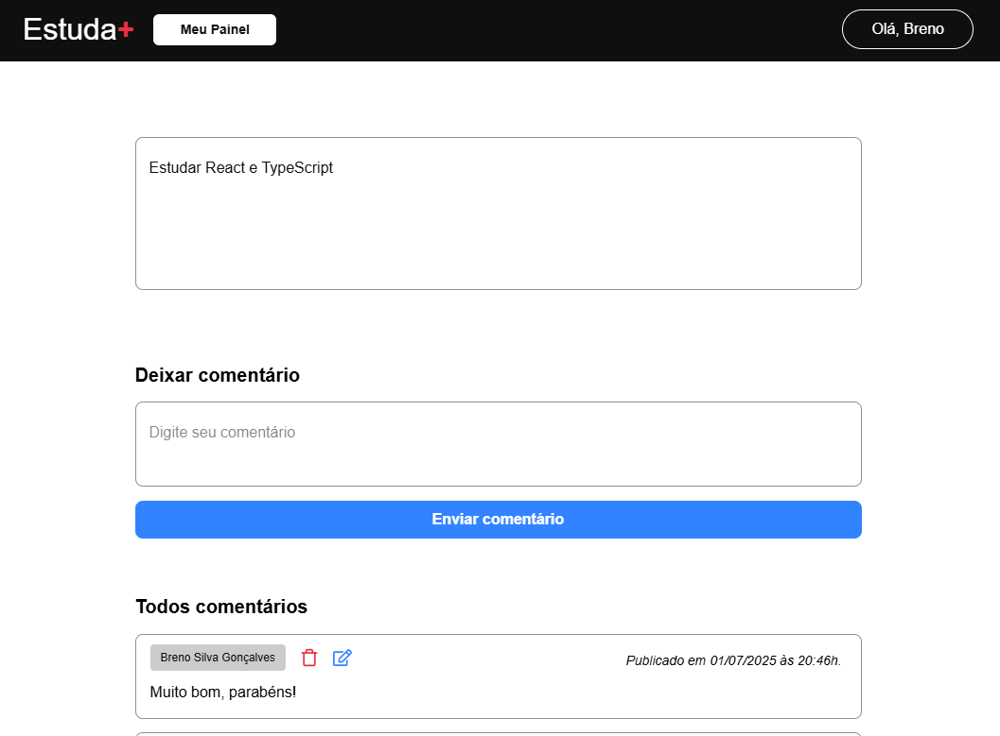

# Estuda Mais - Sistema para organizar estudos.
## Implantação: https://estuda-mais-git-main-brenos-projects-d9dde81c.vercel.app/

## Descrição
- Aplicação Web para gerenciar estudos e comentar sobre tarefas adicionadas.
## Funcionalidades
- Autenticação de usuário;
- Cadastrar, listar, editar e remover tarefas;
- Cadastrar, listar, editar e remover comentários;
- Permitir habilitar tarefa como pública;
- Permitir copiar link de tarefa pública;
- Permitir listar a data de publicação de comentário.
## Tecnologias utilizadas
### Front-end
- Next.js: criação e reutilização de componentes, app router, server-side rendering, react hooks, gerenciamento de formulário com React Hook Form e validação de formulário com Zod;
- NextAuth: autenticação de usuário através do Google Provider;
- React Query e Axios: requisições web;
- TypeScript: benefícios da tipagem estática;
- Tailwind CSS: utilização de classes utilitárias e personalização de tema com variáveis;
- React Icons: pacote de ícones;
- ESLint e Prettier: estilo de código e formatação;
- Gitflow: fluxo de trabalho entre branches develop e main;
- Conventional Commits: organização de commits.
### Back-end
- Express: framework utilizado para estruturar a API RESTfull;
- Node.js e JavaScript: utilizados para desenvolver a API;
- node-postgres: conexão e queries no banco de dados através da API, além de proteção contra SQL Injection; 
- Zod: validação de entradas do client pela API;
- Helmet: definição de cabeçalho HTTP da API;
- Cors: utilizado para lidar com CORS;
- PostgreSQL: banco de dados relacional utilizado para armazenar dados da aplicação;
- Postman: utilizado para testar os endpoints da API;
- ESLint e Prettier: estilo de código e formatação;
- draw.io: utilizado para modelagem de dados do banco de dados;
- Excel: utilizado para desenvolver o dicionário de dados do banco de dados;
- Gitflow: fluxo de trabalho entre branches develop e main;
- Conventional Commits: organização de commits.
## Como rodar a aplicação
- Primeiramente, é necessário ter o PostgreSQL instalado na máquina e criar um banco de dados. Depois, execute o script SQL [schema-config](./back-end/src/config/schema-config.sql) no banco de dados criado;
- Após configurar a estrutura do banco de dados, clone o repositório localmente;
- Depois de clonar o repositório, é necessário configurar um google client secret e um google client id conforme a [documentação](https://developers.google.com/identity/protocols/oauth2) do Google. Também é preciso ter um jwt secret que pode ser obtido por algum gerador de tokens na web;
- Em seguida, selecione o caminho das pastas front-end e back-end e execute o comando npm install em cada uma destas 2 pastas para instalar as dependências da aplicação;
- Depois, execute o comando npm run dev tanto no caminho da pasta front-end como também na pasta back-end que irá rodar o servidor possivelmente na porta 3001 e o front-end possivelmente na porta 3000 localmente;
- Observação: é necessário adicionar um arquivo chamado .env na raiz das pastas front-end e back-end e, em seguida, preencher com as variáveis de ambiente conforme exemplo dos arquivos .env.example.
## Licença
Este código está licenciado usando a [licença-MIT](./LICENSE).
